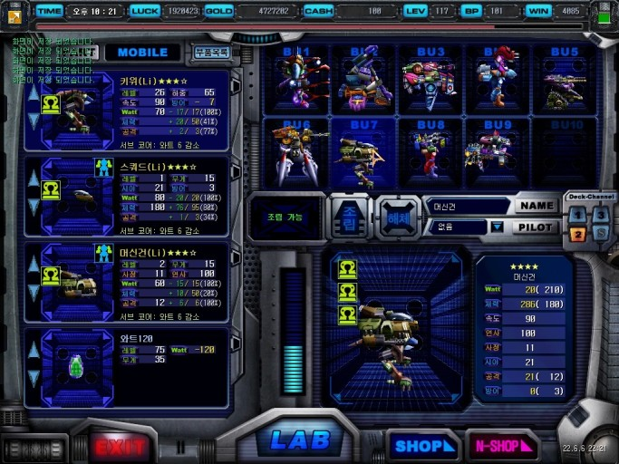
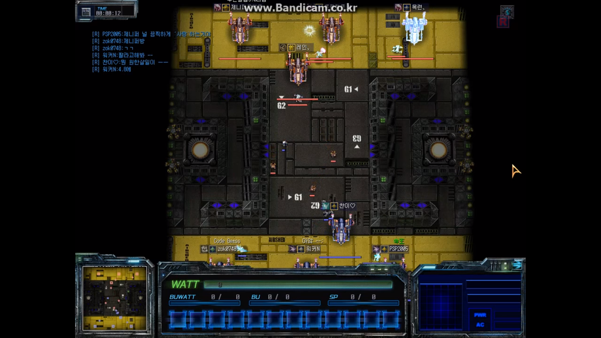
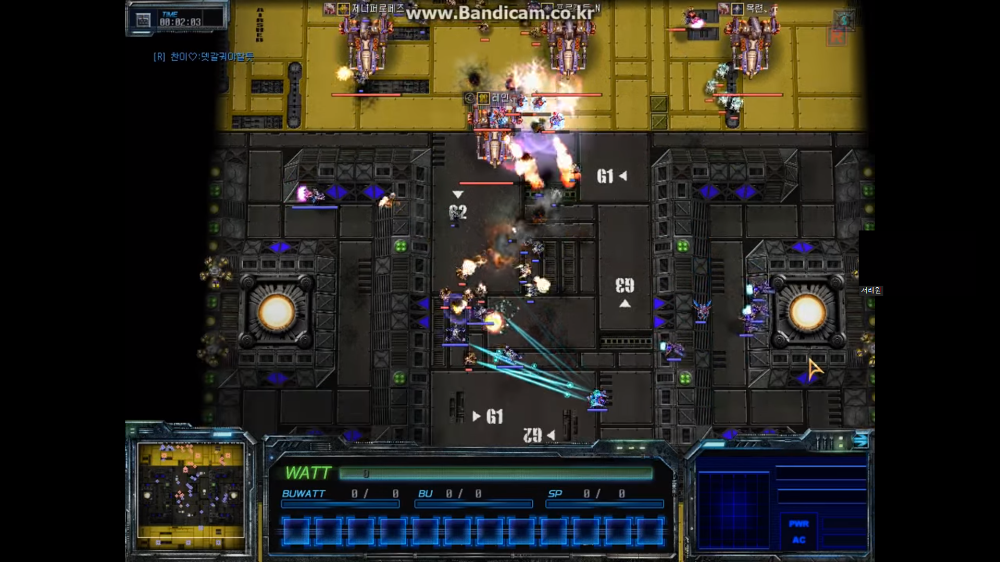

# 로스트 바이블 (Lost Bible)
# [목차]
### 1. [컨셉](#보물)
### 2. [관련 이미지 & 동영상](#2)
### 3. [대표 이미지 & 컨셉과 대표이미지 기반 작품 묘사](#3)
### 4. [Lost Bible의 구성 요소](#4)
### 5. [게임 시스템 디자인](#5)
### 7. [키보드 이벤트에 대한 흐름도](#7)
### 8. [용어 정리](#8)

# [컨셉]

## 메인컨셉 : 컨트롤

- 메인 컨셉 설명 : 미래 시대가 배경이 되는 스토리를 통해 각 플레이어들의 컨트롤로 상대 기지를 격파하는 PVP게임이다.

### 서브 컨셉 1 : 조립

- 현재 게임에 다양한 조립 부품을 넣어두어 많은 조합이 나올수 있게끔 설정해둘 예정입니다.

### 서브 컨셉 2 : 로봇

- 미래시대 배경인 만큼 수많은 전쟁을 통해 인류는 희생을 당하여 로봇으로 추가 전쟁을 일으키는 컨셉을 지정하였습니다

### 서브 컨셉 3 : 자원

- 지금 현재도 무엇을 제작,습득을 하려면 자원이 필요하듯이 로봇 생산에도 자원이 필요하다는것을 느껴 자원 시스템을 도입할 예정입니다.

### 서브 컨셉 4 : 몬스터

- PVP를 좋아하지 않으시는분들도 분명 있을거기 때문에 PVE 컨셉을 도입할 예정입니다.

### 서브 컨셉 5 : 지형지물

- 장소,언덕,지형지물에 따라 시야 차이 혹은 사거리 차이를 두어 다양한 전략이 나올 수 있게 만들예정입니다.

  

# [관련 이미지 & 동영상]

- 이미지

- 동영상 

 

  

[대표 이미지]

  

# [컨셉 & 대표이미지 기반 작품묘사]

> ### 대표이미지 기반 :

> ### 컨셉 기반:

  

# [<로스트바이블(Lost Bible)> 구성 요소]

 

## 1. 메커니즘

[도전 과제]

1) 주어진 맵으로 상대방의 기지를 파괴한다.
2) 다양한 유닛을 만들어 상대방 유닛의 공격을 받아쳐야 한다.
3) 몬스터와의 싸움에서도 승리하여 기지를 공격하고 파괴하여야한다.
4) 위의 1~3번동안 자신의 기지가 파괴되지 않게 해야한다.

[재미 요소]

1) 기본적인 트레이닝 훈련으로 모든 무기를 경험해볼 수 있다.
2) 하체를 어느것을 끼냐에 따라 지상&공중으로 나뉘고 다양한 조합을 만들어 낼 수 있다.
3) 적절한 스킬로 게임의 판도를 뒤집을 수 있기 때문에 유닛뿐만 아니라 외부의 영향으로도 
    재미를 느낄 수 있다.

 

## 2. 이야기

[만들게 된 배경]  

현재 게임회사를 운영예정이고, 게임제작 중인 저에게 다양한 시도를 할 수 있는 시간과, 제작에 필요한 과정에
시간을 조금 더 두고 싶어서 연계하여 제작하게 되었습니다. 분명 많이 겹치는 일이라 효율이 늘 것으로 예상
되지만, 항상 책임감을 가지고 게임제작에 임하기 위하여 회사에서 제작예정인 장르의 게임을 다루고자
만들게 되었습니다.

[카메라 관점]  

기본 시점은 탑뷰에서 시작을 합니다. 하지만 외형을 보기위함일땐 마우스 휠을 올려 근접하게 시점을
바꿀수 있고, 조금 더 넓게 맵을 보고 다양한 관점으로 전력을 짜고싶을땐 특정 키를 눌러 어웨이탑뷰로
플레이가 가능하게 만들것입니다.

 

## 3. 미적요소

[디자인][컬러]  

황폐화된 지구와 주위 행성들. 임의적으로 만들어진 행성에서 전투를 시작합니다. 맵에서 주로 쓰이는 색상은
회색과 약간의 네온사인등으로 간단하게 작업을 할 예정입니다. 몬스터도 빨간색이나. 붉은 갈색(고추장)으로 
간단하게 만들예정이고, 유저들이 사용하는 유닛들은 다채로운 색으로 만들 예정입니다. 또한 전투방식이 
상당히 까다로운 게임이기때문에 최대한 맵활용이 많이 필요한 게임으로 만들예정입니다. 그러므로 스킬창을 
포함한 UI는최대한 작게만들예정입니다.

[음향]  

각 무기들이 공격하는 모션을 통해 효과음을 만들어낼 예정입니다. 배경음은 전투게임이니 만큼 웅장한
배경음으로 만들고, 그 이외의 대기실, 유닛 조립실, 기지실 등은 얇은 배경음으로 긴장을 완화해주는 음악을
만들것입니다.

 

## 4. 기술

유니티 개발 프로그램으로 만들 예정이고, 프로토타입을 만들어 구현 후, 전투방식을 최대한 간단하게
만들예정입니다. 다른 전투 게임들은 그래픽이 좋은 게임들이 많지만, 이 게임은 아기자기한 유닛들로 
구성을 할 수 있는 장점이 있기 때문에, 그 장점을 극대화하여 다양한 색과 조화를 이루어 유저들이 볼 때
루즈하지 않을 정도로 만들 예정입니다.

# [게임 시스템 디자인]
## 4. 게임 오브젝트 분해
|연번|오브젝트 이름|오브젝트 이미지|
|:----:|:----:|:----:|
